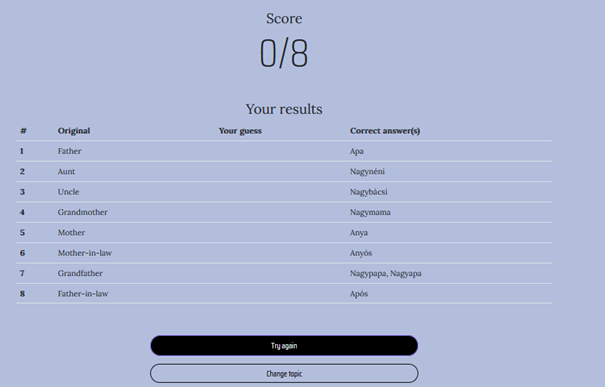

# Word Quiz

## Team

| Name          | Role in group |
| ------------- | ------------- |
| Török Tamás   | Frontend      |
| Kusztos Dávid | Backend       |
| Budai Dávid   | Backend       |
| Bognár Bence  | Teamleader    |

## Summary

User authentication and authorization using JWT tokens
CRUD operations for words, word statistics, and topics
Fetch random words based on player's statistics and selected topics

 Game Features:
 
A fun and interactive word quiz game
Test your vocabulary and language skills
Learn new words and track your progress
Random word generation
Word statistics tracking
Topic selection for personalized gameplay

 Technology Stack :
 
 Backend
ASP.NET Core RESTful API
Entity Framework Core for database access
SQL Server or any other supported relational database
JWT tokens for authentication

 Word Quiz API:
 
Backend service for the Word Quiz game
Handles user authentication, word and topic management, and game logic
Exposes RESTful endpoints for client applications

 User Authentication & Authorization :
 
Secure user registration and login
Role-based access control
JWT tokens for secure API access

 Word & Topic Management:
 
CRUD operations for words and topics
Retrieve random words based on player's statistics and selected topics

Word Statistics Tracking:

Monitor player's progress and performance
Update statistics after each game session
Encourage improvement and learning

## Starting the Project

## Backend

1. **Prerequisites** : Make sure that .NET 6.0 SDK is installed on your local machine as the project is targeting .NET 6.0. You can download it from the [official Microsoft website](https://dotnet.microsoft.com/download/dotnet/6.0). To confirm the .NET version, you can run **dotnet --version** command in the terminal or command prompt.
2. **Clone the Repository** : Clone the repository from GitHub using the **git clone** command. Replace **\<repo-link\>** with your GitHub repository link:

git clone \<repo-link\>

3. **Navigate to the Project Directory** : Use the **cd** command to navigate into the directory containing the project file ( **.csproj** ). This directory contains the project files and the **Program.cs** file where the main function of the application resides.
4. **Restore the Packages** : .NET Core uses NuGet for package management. All the dependencies of the project are mentioned in the **.csproj** file. Run the following command to download all the dependencies:

dotnet restore

5. **Update the Connection String** : The connection string for your database is specified in the **appsettings.json** file. Update the "DefaultConnection" string with your local SQL Server instance details.
6. **Database Migration** : From your project directory, run the following commands to apply migrations and update the database:

dotnet ef migrations add InitialCreate dotnet ef database update

7. **Build the Project** : Run the following command to build the project:

dotnet build

8. **Run the Project** : Finally, run the project using the following command:

dotnet run

Your application should now be running locally. You can access it by navigating to

**https://localhost:7220** or [**http://localhost:5017**](http://localhost:5017/)on your web browser.

Remember to check that your firewall or any other network security settings are not blocking the application's ports (5000 for HTTP and 5001 for HTTPS by default).

## Frontend:

1. **Install Node.js and npm** : Before you start, make sure you have Node.js and npm installed on your computer. Angular requires Node.js version 10.9.0 or later and npm (which comes with Node.js) version 6 or later. You can download Node.js from the official [website](https://nodejs.org/). After installation, you can check the versions using the following commands:

node -v npm -v

2. **Clone the Repository** : First, you need to clone the repository from GitHub to your local machine. Open a terminal and run the following command (replace **url** with the URL of the GitHub repository):

bashCopy code

git clone url

3. **Navigate to the Project Directory** : Change your current directory to the project's directory:

cd word-quiz

4. **Install Angular CLI** : Angular CLI is a command-line interface for Angular. You can install it globally on your machine with the following command:

npm install -g @angular/cli@15.2.1

5. **Install Dependencies** : The next step is to install all the project dependencies. You can do this by running the npm install command:

npm install

This will look at the **package.json** file in your project directory and install all the necessary dependencies listed there.

6. **Start the Development Server** : Finally, you can start your local development server with the Angular CLI command mentioned in the README:

ng serve

This will start the server, and you can access your application by navigating to **http://localhost:4200/** in your browser. The application should automatically reload if you change any of the source files.

Contributing
Feel free to submit issues or pull requests for bug fixes, new features, or improvements.

License
This project is licensed under the MIT License. See the LICENSE file for details.

## Test User

seedplayer@gmail.com <> almafa123

## API Documentation
API documentation is available through the Swagger UI, which can be accessed at https://localhost:7220/swagger after running the application.

**Auth:**

- **POST /api/Auth** : Authenticates a user using their username and password.
  - Input: **{ "userName": "string", "password": "string" }**
  - Output: **200 Success**
- **POST /api/Auth/register** : Registers a new user using their email, player name, and password.
  - Input: **{ "email": "string", "playerName": "string", "password": "string" }**
  - Output: **200 Success**
- **POST /api/Auth/logout** : Logs out the current user.
  - Input: **No parameters**
  - Output: **200 Success**

**Data:**

- **POST /api/Data/import/topics** : Imports topics from a provided file. The file details are provided in the request body.
  - Input: **{ "ContentType": "string", "ContentDisposition": "string", "Headers": "object", "Length": "integer($int64)", "Name": "string", "FileName": "string" }**
  - Output: **200 Success**
- **GET /api/Data/export/topics** : Exports all topics.
  - Input: **No parameters**
  - Output: **200 Success**
- **POST /api/Data/import/words** : Imports words from a provided file. The file details are provided in the request body.
  - Input: **{ "ContentType": "string", "ContentDisposition": "string", "Headers": "object", "Length": "integer($int64)", "Name": "string", "FileName": "string" }**
  - Output: **200 Success**
- **GET /api/Data/export/{dataType}** : Exports data of a specific type (words, users, wordstatistics). The type of data to be exported is specified in the path parameter.
  - Input: **{ "dataType": "string" }**
  - Output: **200 Success**
- **GET /api/Data/user/wordstatistics** : Retrieves the word statistics for a specific user.
  - Input: **No parameters**
  - Output: **200 Success**

**Game:**

- **POST /api/Game/StartGameNoUserNoTopic** : Starts a game without a user and without a specific topic. The number of words for the game is specified in the query parameter.
  - Input: **{ "numberOfWords": "integer($int32)" }**
  - Output: **200 Success**
- **POST /api/Game/StartGameNoUserWithTopic** : Starts a game without a user but with a specific topic. The number of words for the game and the topics are specified in the query parameter and request body respectively.
  - Input: **{ "numberOfWords": "integer($int32)", "topics": ["string"] }**
  - Output: **200 Success**
- **POST /api/Game/StartGameWeighted** : Starts a weighted game, likely taking into account the user's previous performance. The number of words for the game and the topics are specified in the query parameter and request body respectively.
  - Input: **{ "numberOfWords": "integer($int32)", "topics": ["string"] }**
  - Output: **200 Success**
- **POST /api/Game/EndGame** : Ends a game session and updates word statistics. The original words and the user's guesses are provided in the request body.
  - Input: **{ "original": "string", "guess": "string" }**
  - Output: **200 Success**

**Player:**

- **GET /api/Player/all** : Retrieves all players.
- Input: **No parameters**
- Output: **200 Success**
- **GET /api/Player/{id}** : Retrieves a specific player by their ID. The player ID is specified in the path parameter.
  - Input: **{ "id": "string" }**
  - Output: **200 Success**
- **PUT /api/Player/{id}** : Updates a specific player's information. The player ID is specified in the path parameter and the updated player details are provided in the request body.
  - Input: **{ "id": "string", "userName": "string", "normalizedUserName": "string", "email": "string", "normalizedEmail": "string", "emailConfirmed": true, "passwordHash": "string", "securityStamp": "string", "concurrencyStamp": "string", "phoneNumber": "string", "phoneNumberConfirmed": true, "twoFactorEnabled": true, "lockoutEnd": "2023-05-31T06:47:58.225Z", "lockoutEnabled": true, "accessFailedCount": 0, "playerName": "string", "wordStatistics": ["string"] }**
  - Output: **200 Success**
- **DELETE /api/Player/{id}** : Deletes a specific player. The player ID is specified in the path parameter.
  - Input: **{ "id": "string" }**
  - Output: **200 Success**
- **GET /api/Player** : Retrieves the current player's information.
  - Input: **No parameters**
  - Output: **200 Success**

**Topic:**

- **GET /api/Topic** : Retrieves all topics.
  - Input: **No parameters**
  - Output: **200 Success**
- **POST /api/Topic** : Adds a new topic. The topic details are provided in the request body.
  - Input: **{ "id": "string", "title": "string", "description": "string" }**
  - Output: **200 Success**
- **GET /api/Topic/{id}** : Retrieves a specific topic by its ID. The topic ID is specified in the path parameter.
  - Input: **{ "id": "string" }**
  - Output: **200 Success**
- **PUT /api/Topic/{id}** : Updates a specific topic. The topic ID is specified in the path parameter and the updated topic details are provided in the request body.
  - Input: **{ "id": "string", "title": "string", "description": "string" }**
  - Output: **200 Success**
- **DELETE /api/Topic/{id}** : Deletes a specific topic. The topic ID is specified in the path parameter.
  - Input: **{ "id": "string" }**
  - Output: **200 Success**
- **GET /api/Topic/ExportTopics** : Exports all topics.
  - Input: **No parameters**
  - Output: **200 Success**

**Word:**

- **GET /api/Word/Random/{idRandom}** : Retrieves a random word. The ID is specified in the path parameter.
  - Input: **{ "idRandom": "integer($int32)" }**
  - Output: **200 Success**
- **GET /api/Word/RandomWithTopics/{idRandomWithTopic}** : Retrieves a random word from a specific topic. The ID and topics are specified in the path parameter and query parameter respectively.
  - Input: **{ "idRandomWithTopic": "integer($int32)", "mytopicstitle": ["string"] }**
  - Output: **200 Success**
- **POST //api/Word** : Adds a new word. The word details are provided in the request body.
  - Input: **{ "id": "string", "original": "string", "translation": "string", "topicId": "string" }**
  - Output: **200 Success**
- **PUT /api/Word/{id}** : Updates a specific word. The word ID is specified in the path parameter and the updated word details are provided in the request body.
  - Input: **{ "id": "string", "original": "string", "translation": "string", "topicId": "string" }**
  - Output: **200 Success**
- **DELETE /api/Word/{id}** : Deletes a specific word. The word ID is specified in the path parameter.
  - Input: **{ "id": "string" }**
  - Output: **200 Success**
- **POST /api/Word/ImportWords** : Imports words from a provided file. The word details are provided in the request body.
  - Input: **{ "id": "string", "original": "string", "translation": "string", "topicId": "string" }**
  - Output: **200 Success**

**WordStatistic:**

- **GET /api/WordStatistic** : Retrieves all word statistics.
  - Input: **No parameters**
  - Output: **200 Success**
- **POST /api/WordStatistic** : Adds a new word statistic. The word statistic details are provided in the request body.
  - Input: **{ "id": "string", "playerId": "string", "wordId": "string", "score": 0, "player": { "id": "string", "userName": "string", "normalizedUserName": "string", "email": "string", "normalizedEmail": "string", "emailConfirmed": true, "passwordHash": "string", "securityStamp": "string", "concurrencyStamp": "string", "phoneNumber": "string", "phoneNumberConfirmed": true, "twoFactorEnabled": true, "lockoutEnd": "2023-05-31T06:47:58.225Z", "lockoutEnabled": true, "accessFailedCount": 0, "playerName": "string", "wordStatistics": ["string"] }, "word": { "id": "string", "original": "string", "translation": "string", "topicId": "string" } }**
  - Output: **200 Success**
- **GET /api/WordStatistic/{id}** : Retrieves a specific word statistic by its ID. The word and ID are specified in the query parameter and path parameter respectively.
  - Input: **{ "word": "string", "id": "string" }**
  - Output: **200 Success**
- **PUT /api/WordStatistic/{id}** : Updates a specific word statistic. The word statistic ID is specified in the path parameter and the updated word statistic details are provided in the request body.
  - Input: **{ "id": "string", "playerId": "string", "wordId": "string", "score": 0, "player": { "id": "string", "userName": "string", "normalizedUserName": "string", "email": "string", "normalizedEmail": "string", "emailConfirmed": true, "passwordHash": "string", "securityStamp": "string", "concurrencyStamp": "string", "phoneNumber": "string", "phoneNumberConfirmed": true, "twoFactorEnabled": true, "lockoutEnd": "2023-05-31T06:47:58.225Z", "lockoutEnabled": true, "accessFailedCount": 0, "playerName": "string", "wordStatistics": ["string"] }, "word": { "id": "string", "original": "string", "translation": "string", "topicId": "string" } }**
  - Output: **200 Success**
- **DELETE /api/WordStatistic/{id}** : Deletes a specific word statistic. The word statistic ID is specified in the path parameter.
  - Input: **{ "id": "string" }**
  - Output: **200 Success**
- **DELETE /all** : Deletes all word statistics.
  - Input: **No parameters**
  - Output: **200 Success**
- **GET /api/WordStatistic/{idRandom}** : Retrieves a random word statistic. The player and ID are specified in the query parameter and path parameter respectively.
  - Input: **{ "idRandom": "integer($int32)", "player": "string"}**
  - Output: **200 Success**
- **GET /api/WordStatistic/{idRandomWithTopic}** : Retrieves a random word statistic from a specific topic. The player, ID, and topics are specified in the query parameter, path parameter, and request body respectively.
  - Input: **{ "idRandomWithTopic": "integer($int32)", "player": "string", "topics": ["string"] }**
  - Output: **200 Success**

## UI

**Home Page:** This page provides an overview of the website. It includes several key sections: a header which advertises expanding vocabulary, a section showing some stats like the number of words and topics available, a showcase of popular topics, a section promoting a gaming feature for learning words, and testimonials from users.

**Footer:** The footer contains a logo, links to the source code and the requirements on GitHub

**Navbar:** This section includes a logo and a set of links. For logged-in users, it provides links to word statistics, data import/export, and game start, and greets the user by their name. It also provides an admin link for admin users. For users who aren't logged in, it provides a link to log in or sign up.

**Topic Selection** : This section provides an overview of all available topics. Each topic card includes the title, description, and a link to start playing .

**Game** :

 This component prompts the user to start the game and provides information about the topic and the max time seconds. It also includes a button to start the game and a link to change the topic.

This is the main page for playing the vocabulary game. It displays the topic, provides an input box for the user to type their guess, shows the remaining time, displays a progress bar, and a button for submitting all guesses. Depending on the game phase, it can also show a game start component, a loading spinner, or a game result component.

**Results** :

This component displays the user's score and a detailed result of each word including the user's guess and the correct answer. It also offers a button to try again or a link to change the topic.

**Statisctis** :
 This page displays a bar chart of word statistics.

**Admin Topic** : This is the administrative view for managing topics. It displays a table of topics with their respective number of words. From this view, an admin can manage each topic or add a new one.

**Admin Topic Add** : This component is a form for creating a new topic. It asks for the title and description of the new topic.

**Admin Topic Details** : This is the detailed administrative view for a specific topic. An admin can add new words to the topic (with their original form and translation) and delete the entire topic if needed.

**Data Import/Export** : This section provides tools for importing and exporting data. It allows an admin to select a data type (topics, words, users, word statistics) and either import this data from a file or export it for download.

Future Plans:

Multiplayer mode
Leaderboards and achievements
Integration with other language learning tools
Support for additional languages

## Difficulties

**Problems** :

Problem:
 - Fontend Word Statisctic score displayed every instance of a word in a different columb
 Solution:
 - Use of ChartDataset mapped barChartData to stat.score and barChartLabels to stat.word.original

 Problem:
 - Registartion would give a back a whole player object, with unsave attributes
 Solution:
 - Removed unnecessary response

Problem:
 - Backend creating Statistics without loged in user, would crach the backend.
 Solution:
 - Added several checks for logged in user and not making statistics a fixed step.

Problem:
 - Backend async API endpoints crushed the frontend server.
 Solution:
 - Changed problematic backend API endpoints to be sync.

Problem:
 - Backend Exporting topic would export all words related and exporting words would export in a loop.
 Solution:
 - Use of System.Text.Json.JsonSerializer.Serialize instead of Newtonsoft.Json
